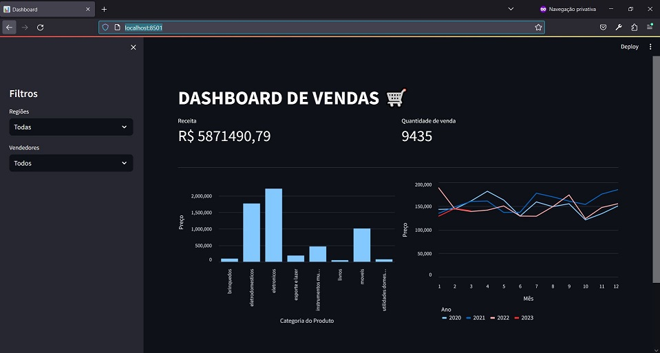
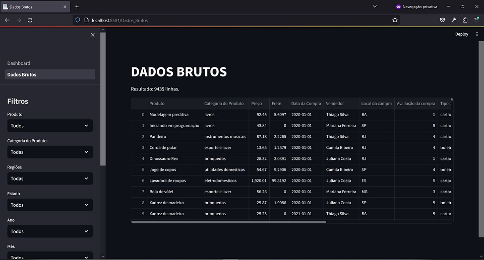

# Alura - Streamlit - Dashboard de Vendas
Projeto da demonstração do curso Alura - Streamlit - construindo um dashboard interativo.

## Execução
Para executar o aplicativo, execute o seguinte comando no terminal:
`streamlit run Dashboard.py`

## Desenvolvimento
As etapas do desenvolvimento do projeto foram:
1. Em `Notebooks/DataPipeline.ipynb`, prototipar a obtenção e processamento dos dados;
2. Em `Scripts/DataPipeline.py`, refatorar e executar o código anterior;
3. Em `Dados/dados.csv`, inspecionar se os dados foram obtidos com sucesso;
4. Em `Dashboard.py`, criar o código para a página principal do aplicativo;
5. Em `pages/Dados_Brutos.py`, criar o código para a página secundária do aplicativo.

## Dados 
Os dados foram obtidos a partir de `https://labdados.com/produtos`

As colunas dos dados originais são:
- Produto
- Categoria do Produto
- Preço,Frete
- Data da Compra
- Vendedor
- Local da compra
- Avaliação da compra
- Tipo de pagamento
- Quantidade de parcelas
- lat
- lon

As colunas adicionais criadas são:
- Região
- Ano
- Mês

## Resultados

## Referências
Alura - Streamlit - Construindo um dashboard interativo:
https://www.alura.com.br/conteudo/streamlit-construindo-dashboard-interativo